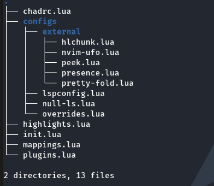

# :wrench: My Neovim configuration
Welcome to the NVChad custom folder! This folder is designed to house all your custom plugins and modifications for your NVChad setup. It provides a convenient way to add new functionality an customize your NVChad configuration without modifying the core files directly.
##  plugins

The following plugins are included in my Neovim configuration:

```lua
"andweeb/presence.nvim"     --Discord presence integration for Neovim
"andweeb/presence.nvim"     --Preview markdown README files in Neovim
"folke/trouble.nvim"        -- diagnostics [check the mapping key to know how to use it]
```
## :sleepy: open markdown Preview 
| Command  | Description              |
| -------- | ------------------------ |
| OpenMark | Open the Preview mode    |
| CloseMark| Close the window         |

you can always change these commands by changing the file ``init.lua``
[click here to change.](https://github.com/div-styl/nvchad-custom/blob/main/custom/init.lua)

## Getting Started
To begin, make sure you have NVChad already set up and running on your system. If you haven't installed NVChad yet, please refer to the official [NVChad documentation](https://nvchad.com/docs/quickstart/install)  or [Nvchad webisite](https://nvchad.com) for instructions on how to set it up.

Once you have NVChad up and running, follow these steps to utilize the custom folder:

- Locate the NVChad custom folder in your NVChad installation directory.
- Copy your custom plugins and modifications into the custom folder.
- Ensure that you adhere to the folder structure and naming conventions outlined by NVChad.

## Folder structure
The custom folder should mirror the structure of the NVChad installation directory. This structure helps maintain organization and ensures that NVChad can find and load your custom additions correctly.


## Discord Presence Not Working

Please note that the Discord presence feature may not work properly if you are using the Flatpak or Snap version of Discord.

The Discord presence feature allows you to show your activity and status on Discord, such as the game you are playing or the music you are listening to. However, due to limitations in the Flatpak and Snap packaging systems, certain functionality, including the presence feature, may be restricted or unavailable.

To ensure full compatibility and access to all Discord features, it is recommended to use the official standalone version of Discord provided by [the official Discord website](https://discord.com/download).
